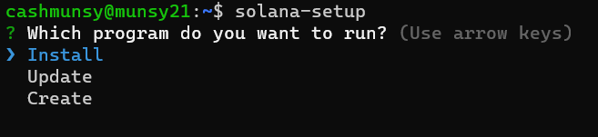
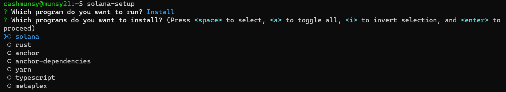
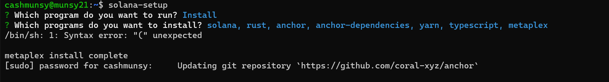
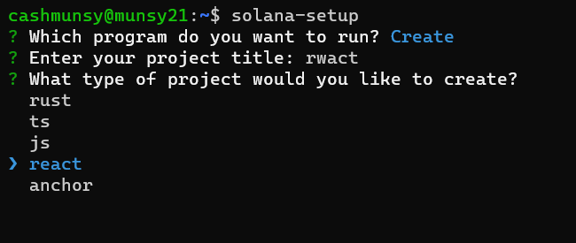
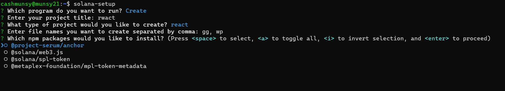
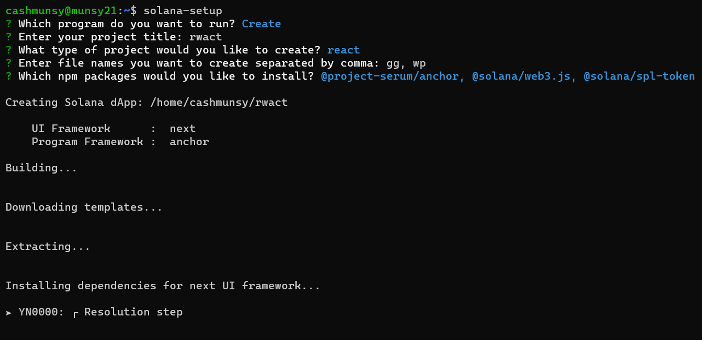
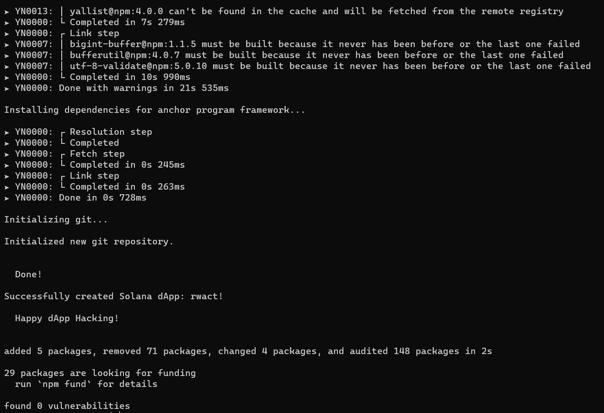

# Solana Setup Tool
Solana Setup is a command-line tool designed to streamline the developer experience on the Solana blockchain. It simplifies the processes of installing, updating, and configuring your development environment, and even creating a new project with a single command.

## Features
Install crucial development tools including Solana CLI, Rust, Anchor, Yarn, and TypeScript.
Seamlessly update all the aforementioned tools to their latest versions.
Generate a new project with your choice of dependencies, such as @solana/web3.js, @project-serum/anchor, and @solana/spl-token.

## Installation
To install Solana Setup, you'll need Node.js and npm (which comes with Node.js). You can download Node.js [here](https://nodejs.org/en/download/).

Once you have Node.js and npm installed, you can install Solana Setup globally using the following command:

`npm install -g solana-setup`

## Usage
Usage
Simply run solana-setup in your terminal and follow the interactive prompts to specify the operation you want to perform.

You can perform the following operations:

## Install Programs
To install a program or npm package, choose the 'install' option and then select the desired programs or packages.
`solana-setup`

#### Updating Programs
To update a program or npm package, choose the 'update' option and then select the desired programs or packages. For example:
`solana-setup`

#### Creating a New Project
To create a new project, choose the 'create' option and then follow the prompts to specify the project details. For example:
`solana-setup`

### Tools Used
The available programs for 'install' are solana, rust, anchor, anchor-dependencies, yarn, typescript.

the available programs for 'update' are solana, rust, yarn, anchor, and typescript.

the available programs for 'create' are anchor, rust, react, typescript, and javascript and the following npm packages can be added: @solana/web3.js, @project-serum/anchor, @solana/spl-token, @metaplex-foundation/mpl-token-metadata.

### You can clone the repo and run locally
`node ./indexjs or ./create.js`

## Updating Solana Setup
To update the Solana Setup tool itself, use the following command:
`npm update -g solana-setup`

### Contributing
If you're interested in contributing to Solana Setup, please feel free to submit a pull request on the GitHub repository [here](https://github.com/DegenMunsy/solana-setup).

### Requests
Want to see more packages or functions added to the tool? Contact @cashmunsy on twitter and let him know what you want to see solana-setup add next.

License
Solana Setup is licensed under the ISC license.